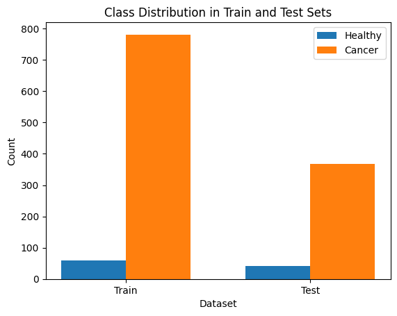
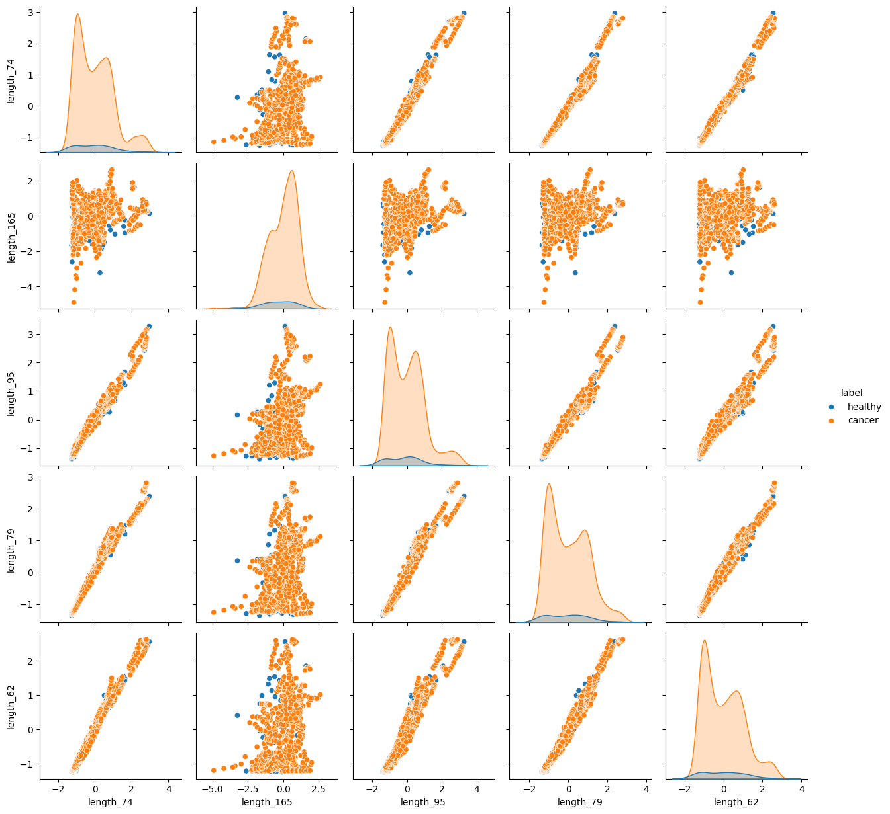
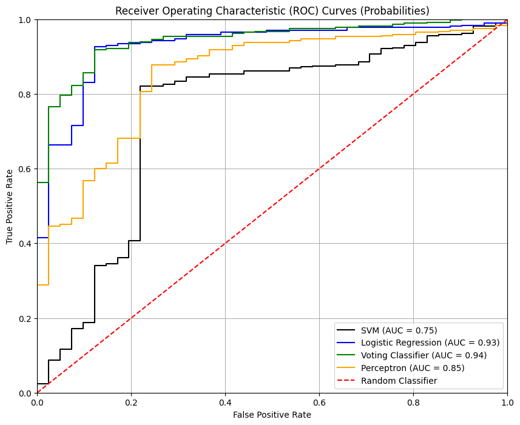

# Cancer Dataset Analysis

## Objective

This project analyzes a cancer dataset to identify key features associated with cancer diagnosis and to develop predictive models capable of distinguishing between cancerous and healthy samples. A central focus is on gene expression analysis, where bioinformatics methods are used to extract meaningful patterns from genetic data. These patterns may indicate early-stage cancers and support timely, accurate detection.  The notebook explores the data, performs preprocessing, and applies machine and deep learning models to achieve high AUC in cancer prediction.

---

## Google Colab Link

You can run the notebook directly in Google Colab:

**[Open in Colab](https://drive.google.com/drive/folders/1VJJoS7gxyrvXVCld_T-GK74u_cUw-oM6?usp=sharing)**

---

## Requirements

The following libraries are required (available by default in Colab):

- Python 3.10
- `numpy`, `pandas`, `scikit-learn`, `matplotlib`, `seaborn`, `tensorflow`

> ℹ️ Use `!pip install` in Colab for any missing libraries.

---

## Usage

1. Open the Notebook in Google Colab via the link above.
2. Run all cells sequentially.
3. Some cells may take longer to execute (e.g., `RandomizedSearchCV` blocks).

---

## Data Uploads

If the notebook requires data files:

- Upload the dataset directly to Colab, or  
- Mount your Google Drive:

```python
from google.colab import drive
drive.mount('/content/drive')
```

---

## Notebook Overview

This notebook is organized into the following main sections:

---

### Data Loading
- Loads the cancer dataset, typically from a CSV file or similar format.
- Provides an initial preview of the data, examining its shape, feature names, and the first few rows.

---

### Data Preprocessing
- Standardizes or normalizes features for optimal model performance.
- Handles class imbalance.



**Exploratory Data Analysis (EDA):**
- Visualizes the distribution of key features using histograms, scatter plots, and box plots.
- Examines correlations between features and the target variable to identify important predictors.



---

### Feature Extraction
- Performs feature selection using Gradient Boosting Machines (GBM).
- Applies dimensionality reduction techniques such as Principal Component Analysis (PCA) and Linear Discriminant Analysis (LDA) to retain the most relevant features.

---

### Model Training
- Trains multiple machine learning and deep learning models including logistic regression, support vector machines, and neural networks.
- Configures model parameters and uses validation techniques to assess performance and stability.

---

### Model Evaluation
- Evaluates model performance on the test set using accuracy, precision, recall, F1-score, and AUC-ROC.
- Visualizes performance through confusion matrices and ROC curves.



---

### Predictions and Interpretation
- Generates predictions on test data and interprets results.

---

### Hyperparameter Tuning
- Optimizes model parameters using:
  - Manual tuning for SVM and MLP
  - RandomizedSearchCV for logistic regression and voting classifiers

---
